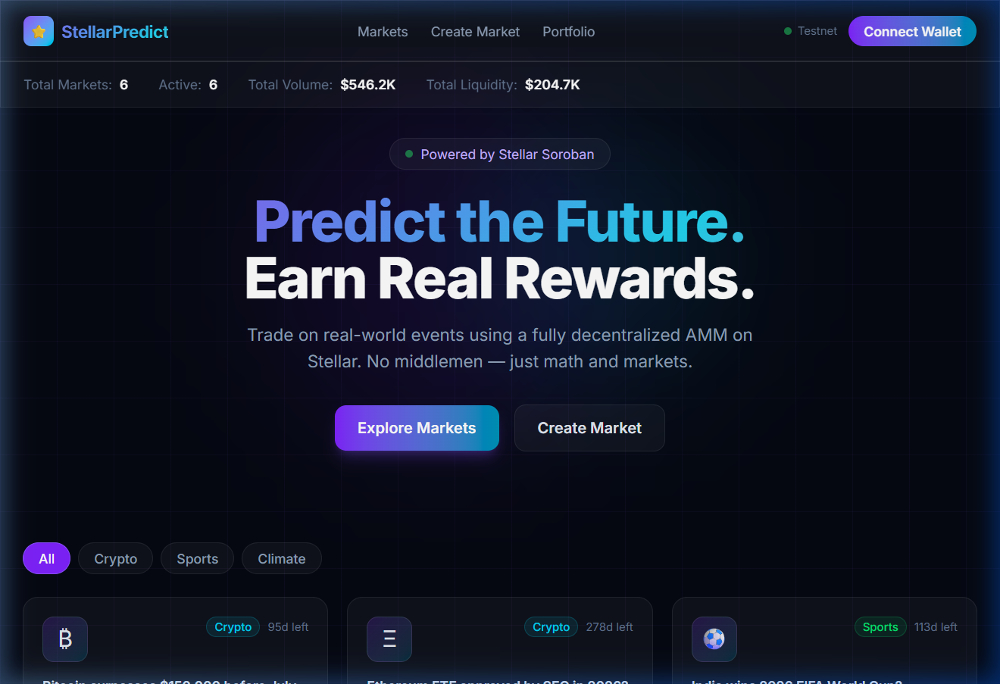
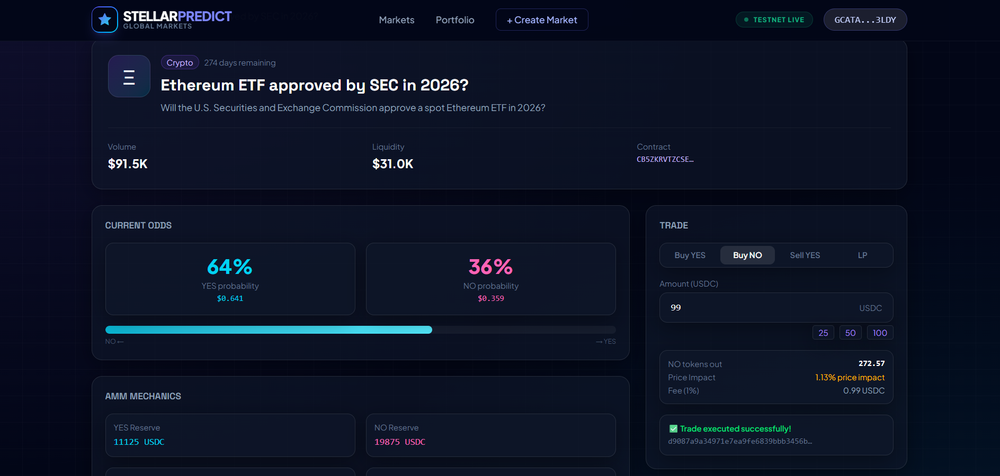

# 🚀 Stellar Predict - Level 5



Welcome to **Stellar Predict**, a fully decentralized prediction market platform built on the **Stellar Soroban** blockchain. This project represents the pinnacle of decentralized application development, featuring a robust multi-wallet ecosystem, advanced smart contract architecture, and a premium user experience.

---

## 🔗 Important Links (Submission Requirements)
*   **Live Demo UI**: [stellar-prediction-market-level-5.vercel.app](https://stellar-prediction-market-level-5.vercel.app/)
*   **Architecture Document**: [ARCHITECTURE.md](./ARCHITECTURE.md)
*   **MVP Demo Video**: 👉 [Watch the Loom Demo Video](https://www.loom.com/share/cd5dfb1ff78a4526890882e7f014e246) 👈
*   **Deployed Smart Contract IDs (Testnet)**:
    *   `CB5ZKRVTZCSERHLYMLXZ6EWSVJ3DY7J6JVRMUKPNYDS2VGODLCLE4V37`
    *   `CDCZYILWPDOZMFE3YK2SY6ES6NBN53GXVOFTDH2GSOQ7DKLQ5FNJCN3L`

---

## 🌟 Key Features

### 1. Multi-Wallet Integration
Experience seamless connectivity with the most popular Stellar wallets:
*   **Freighter**: The standard browser extension for the Stellar ecosystem.
*   **Albedo**: A web-based wallet provider that works across all devices, including mobile.
*   **xBULL**: A powerful and flexible wallet for advanced users.

### 2. Advanced Smart Contracts (Soroban)
Our core logic is built with Rust on the Soroban smart contract platform:
*   **Factory Pattern**: Deploy new prediction markets on-the-fly.
*   **Automated Market Making**: Fair price discovery based on supply and demand.
*   **Collateral Management**: Secure handling of assets for placing bets.

### 3. Premium User Experience (UX)


*   **Real-time Sentiment**: Integrated sentiment tracking (Yes vs No) for every market.
*   **Interactive Visuals**: Confetti celebrations for successful trades.
*   **Optimistic UI**: Smooth and responsive transitions for a modern feel.
*   **Fully Responsive**: Built with Tailwind CSS, ensuring a great experience on any screen size.

---

## 🛠️ Tech Stack

*   **Frontend**: [Next.js 14](https://nextjs.org/) (App Router), [Tailwind CSS](https://tailwindcss.com/)
*   **Language**: [TypeScript](https://www.typescriptlang.org/)
*   **Blockchain**: [Stellar](https://www.stellar.org/) / [Soroban](https://soroban.stellar.org/)
*   **Smart Contracts**: [Rust](https://www.rust-lang.org/)
*   **Styling**: Modern, Dark-themed UI with Glassmorphism effects.

---

## 🚀 Getting Started

### Prerequisites
*   Node.js (v18 or higher)
*   Stellar Wallet Extension (Freighter/xBULL) or an Albedo account.

### Installation
1.  **Clone the Repository**:
    ```bash
    git clone https://github.com/harshaljagdale0222/stellar-prediction-market-level-5.git
    cd stellar-prediction-market-level-5
    ```

2.  **Install Dependencies**:
    ```bash
    cd app
    npm install
    ```

3.  **Run Development Server**:
    ```bash
    npm run dev
    ```

4.  **Visit the App**: Open [http://localhost:3000](http://localhost:3000) in your browser.

---

## 👥 User Feedback & Onboarding

### 📋 User Feedback Form
We onboarded **6 real testnet users** and collected their feedback to validate our MVP.

🔗 **[Fill the Feedback Form](https://docs.google.com/forms/d/e/1FAIpQLSdOOHZLjF5DWGUxHkEs6dP7HG51fCXxp8juZMo2nv3QNzKCNQ/viewform)**

### 📊 Collected Responses (Google Sheet)
All user responses have been exported and are available for review:

📊 **[View Response Sheet](https://docs.google.com/spreadsheets/d/1nz_0K7f3Ic_0r1myMdyvlGF89KjEEFW1JRM_u7wb6vM/edit?usp=sharing)**

### 📝 Feedback Summary & Verified Wallets (5+ Users requirement)

| # | User | Stellar Wallet Address (Verified) | Key Feedback |
|---|------|-----------------------------------|--------------|
| 1 | Rushikesh Gaiwal | `GBXU3XKT5W66VJOTZBEINMAXQYGJ7HYNFWITQQ6VQKZBHDQ2EX5ACG2F` | *"Impressive UI but lag in between, please improve UX"* |
| 2 | Shubham Golekar | `GA3PMUXWSCWLT2FMQ76PODPODHLJHOWAHTD7JGOWHGGE5FZ3WWF6EJBO` | *"Need improvements in integration of wallet"* |
| 3 | Samruddhi Nevse | `GCWHSFPEKYG5OYYQT2M5VRRVM3LSCXACMBNKSZUTH7XCIUGQTGFDAYWD` | *"All good"* |
| 4 | Sudhakar Sutar | `GALULA4PSYS4AVX7AIUDZ5IVUUWJAGT4BECMICA3JQMCO3HICKQEKJXS` | *"Good website"* |
| 5 | Dnyaneshwari Badhe | `GDLLRKGBCPUYRJE3HFYUNI46PQQNA5HPP6QR43FDPZJXNVHEW5QJ5LKV` | *"Useful"* |
| 6 | Ved Kishor Malkunaik | `GACUAJJ5XYAOHFRNASQU472IEZHMU5G37CLNPGKA7HK55MEFZV6ZJQ45` | *"Very nice bro"* |

**Overall Sentiment:** Positive ✅ — Users appreciate the UI and core functionality. Key improvement areas: performance & wallet UX.

---

## 🔮 Future Improvement Plan

Based on the collected user feedback, here is our roadmap for the next phase:

### 🐛 Issues Identified from User Feedback
- **UI Lag** ΓÇö Users reported lag between page transitions
- **Wallet Integration UX** ΓÇö Wallet connection flow needs to be smoother

### ✅ Planned Improvements (Next Iteration)

#### ΓÜí 1. Performance Optimization
- Implement lazy loading for market cards to reduce initial load time
- Add skeleton loaders for better perceived performance
- Optimize API call caching to eliminate page transition lag

#### 🔗 2. Wallet Integration Enhancement
- Improve error messages when wallet connection fails
- Add auto-reconnect functionality on page refresh
- Provide step-by-step wallet connection guide for new users

#### 📱 3. Mobile Experience
- Improve trading panel layout for small screens
- Add touch-friendly interactions for mobile users

#### 📊 4. Portfolio Dashboard
- Add real-time portfolio view showing current positions and P&L
- Show trade history with timestamps and outcomes

#### 🔔 5. Trade Notifications
- Real-time toast notifications for trade confirmations
- Alerts for market resolution events

> 🔗 **Improvement Commit:** [View on GitHub](https://github.com/harshaljagdale0222/stellar-prediction-market-level-5/commit/7f9ade8)

---

## 📂 Project Structure

*   `/app`: The Next.js frontend application.
    *   `/app/context`: Global state management for wallet connections.
    *   `/app/lib`: Core logic for interacting with the Stellar network.
    *   `/app/components`: Reusable UI components.
*   `/contracts`: Rust-based Soroban smart contracts.
    *   `/contracts/market`: The main prediction market logic.

---

## 📄 License

This project is licensed under the MIT License.

---

*Developed for the Stellar Level 5 Milestone.*
